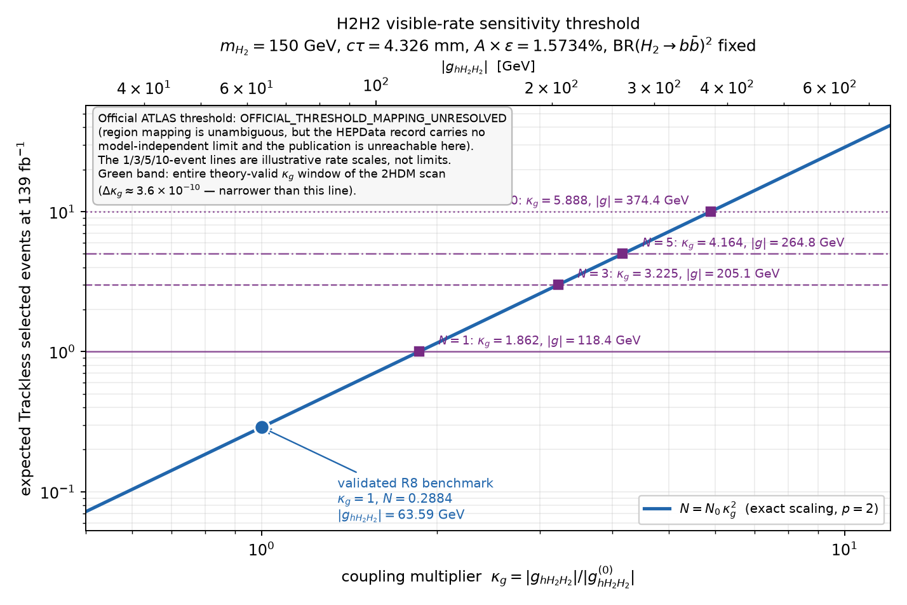
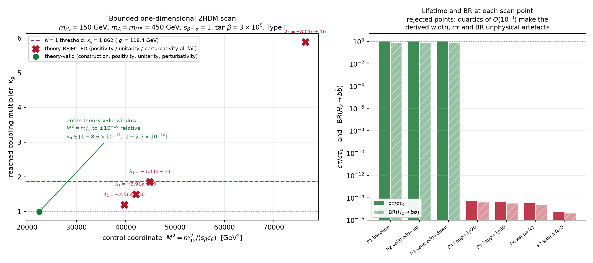

# R9 — How large must the h–H2–H2 coupling become, and can the 2HDM deliver it?

**Benchmark** `H2scan_mH150_tb300000` · **Status** COMPLETE · **Next step** `THRESHOLD_NOT_MODEL_REACHABLE`

Artifacts: [`results/r9_h2_sensitivity_threshold/`](../results/r9_h2_sensitivity_threshold/)

---

## 0. The question, and the four answers it decomposes into

R8 showed that the validated 2HDM LLP benchmark **is accepted** by the ATLAS DV+jets Trackless
selection — but yields only **0.2884 expected events at 139 fb⁻¹**. R9 asks how much larger the
model-derived production coupling would have to be for that to matter, and whether the 2HDM can
supply it.

The result separates cleanly into four statements that must not be conflated:

| Question | Answer |
|---|---|
| **Phenomenological threshold** — how large must the coupling become? | \|g\| ≥ **118.41 GeV** (κ_g = 1.862, rate ×3.467) for one event; **374.45 GeV** (κ_g = 5.888) for ten |
| **Model reachability** — can the 2HDM produce that coupling? | **No.** The entire theory-valid range of the only coordinate that reaches the trilinear moves κ_g by **3.6 × 10⁻¹⁰** |
| **Experimental relevance** — would it reach the official threshold? | **Undetermined.** Region mapping is unambiguous; no official model-independent limit is readable here → `OFFICIAL_THRESHOLD_MAPPING_UNRESOLVED` |
| **Acceptance stability** — does changing the model force a new recast? | **No.** ctau moves by < 6 × 10⁻⁵ relative across the theory-valid window |

---

## 1. Frozen baseline

Every value below was read from a primary artifact, not retyped, and each is carried with its
source path and SHA-256 in [`baseline.json`](../results/r9_h2_sensitivity_threshold/baseline.json).

| Quantity | Value | Source |
|---|---|---|
| `m_H2` | 150.0 GeV | `dihiggs_hep_cross` production manifest |
| `ctau` | 4.32622152973311191 mm | `dihiggs` coupling artifact |
| `g_hH2H2` | +63.5914252007596588 GeV | `dihiggs` coupling artifact |
| `GHphiphi` | −63.5914252007596588 GeV | production manifest (= −`g_hH2H2`) |
| `sigma(H2H2)` | 2.30291167568 × 10⁻⁴ pb | MG5 3.5.3, runs 01+02 combined |
| `BR(H2→bb)²` | 0.5726516224278888 | production manifest |
| `Trackless A×eff` | 0.01573386 | R8 `normalization.json` |
| `L` | 139 fb⁻¹ | R9 specification |

Recomputed independently by [`scripts/r9_recompute_check.py`](../scripts/r9_recompute_check.py):

```
sigma_4b        = 0.230291167568 fb × 0.5726516224278888  = 0.131876610738628   fb
visible sigma   = 0.131876610738628 fb × 0.01573386       = 0.0020749281306360694 fb
expected events = 0.0020749281306360694 fb × 139 fb^-1    = 0.28841501015841364
```

All three reproduce the frozen values **bit-for-bit**.

R8 status is carried unchanged: `recast_validation_status = VALIDATED`,
`acceptance_status = RECAST_ACCEPTANCE_COMPUTED`, `exclusion_status = NOT_RUN`,
`highpt_statistics_status = INSUFFICIENT_MC_STATISTICS`.

---

## 2. Q1 — Does σ(pp → H2H2) scale quadratically with \|g_hH2H2\|?

**Yes, exactly: p = 2.** Not approximately, and not by dimensional reasoning.

### 2.1 The requested MadGraph runs could not be executed

The four integration-only runs at κ_g ∈ {0.5, 1, 2, 4} were prepared but **not run**. MG5_aMC is
not installed in this environment and cannot be obtained: every MadGraph distribution host is
denied by the session's egress policy (`launchpadlibrarian.net` returns *403 to CONNECT*;
`cp3.irmp.ucl.ac.be`, `feynrules.irmp.ucl.ac.be`, `madgraph.phys.ucl.ac.be`, `zenodo.org` and the
`mg5amcnlo` GitHub release assets are all refused). Independently, the canonical version **3.5.3
is no longer published upstream** — launchpad's 3.5.x series now offers only
3.5.6 / 3.5.8 / 3.5.9 / 3.5.10 / 3.5.12.

`madgraph_coupling_scaling.csv` therefore ships with the measured columns **empty** and
`status = NOT_EXECUTED_MADGRAPH_UNAVAILABLE_EGRESS_BLOCKED`. **No cross section was invented or
recalled.** A ready-to-run deck is committed under
[`madgraph_deck/`](../results/r9_h2_sensitivity_threshold/madgraph_deck/) reproducing the canonical
settings exactly (MG 3.5.3, `g g > H > h2 h2`, √s = 13 TeV, `nn23lo1` / lhaid 230000,
`dynamical_scale_choice = -1`, `use_syst True`), together with
[`scripts/r9_ingest_madgraph_scaling.py`](../scripts/r9_ingest_madgraph_scaling.py), which fills the
table, computes residuals against κ² and performs the weighted log–log fit. That ingest path is
unit-tested end-to-end against a synthetic quadratic sample and recovers p = 2.000000000.

### 2.2 Why the scaling law is nevertheless *exact*

Instead of a four-point numerical fit, the exponent is established by tracing the coupling through
the shipped UFO. Seven checks, all machine-verified in
[`madgraph_scaling_fit.json`](../results/r9_h2_sensitivity_threshold/madgraph_scaling_fit.json)
with per-file SHA-256:

1. `GHphiphi` is declared **exactly once**, as an external real parameter (`FRBlock 3`).
2. It appears in **exactly one** coupling: `GC_90 = complex(0,1)*GHphiphi`.
3. `GC_90` is used by **exactly one** vertex: `V_7 = (H, h2, h2)`.
4. **No** partial width in `decays.py` depends on `GHphiphi`.
5. The mediator width is a fixed external number in the run param card — `DECAY 25 4.070000e-03`,
   *not* `Auto` — so the propagator cannot acquire coupling dependence.
6. The generated process is `g g > H > h2 h2` (banner-confirmed), a **single diagram**.
7. `H → h2 h2` is kinematically closed (m_H = 125.13 GeV < 2 × 150 GeV), so even an auto-computed
   width would be unaffected.

The amplitude is therefore **strictly linear** in `GHphiphi`, with no interference, no competing
topology and no width or propagator feedback. Hence |M|² ∝ GHphiphi² with phase space untouched:

> **σ(κ_g) = σ₀ · κ_g², exactly.**

Changing `GHphiphi` affects the overall matrix-element normalisation **and nothing else** — not the
mediator width, not interference, not the diagram count, not the phase-space distributions. A
useful corollary: because a κ_g rescaling multiplies the single amplitude by a constant, the
**production kinematics are identical**, so the validated R8 acceptance is *exact* for a
coupling-only reinterpretation rather than an approximation.

The only measured cross sections that exist for this point are the two canonical κ_g = 1 runs
(2.2986 ± 0.0075 × 10⁻⁴ and 2.3054 ± 0.0057 × 10⁻⁴ pb), which are statistically compatible. That
validates the integration but does not by itself test the scaling law, and is reported as such.

---

## 3. Q2, Q3 — Illustrative yield thresholds

At fixed m_H2, ctau, BR(H2→bb), Trackless acceptance and production kinematics
([`yield_thresholds.csv`](../results/r9_h2_sensitivity_threshold/yield_thresholds.csv)):

| N selected | rate multiplier | κ_g | required \|g_hH2H2\| | required GHphiphi | required visible σ |
|---:|---:|---:|---:|---:|---:|
| 1 | 3.4672 | 1.862049 | **118.410 GeV** | −118.410 GeV | 0.0071942 fb |
| 3 | 10.4017 | 3.225163 | 205.093 GeV | −205.093 GeV | 0.0215827 fb |
| 5 | 17.3361 | 4.163668 | 264.774 GeV | −264.774 GeV | 0.0359712 fb |
| 10 | 34.6723 | 5.888315 | 374.446 GeV | −374.446 GeV | 0.0719424 fb |

Each row was recomputed from the primary inputs, not copied; all four agree with the
specification's sanity values to better than 0.01 %. Every row is stamped
`ILLUSTRATIVE_RATE_SCALE_NOT_DISCOVERY_OR_EXCLUSION`: these are **descriptive rate scales**, not
discovery or exclusion criteria.



---

## 4. Q4 — The official ATLAS threshold

**`OFFICIAL_THRESHOLD_MAPPING_UNRESOLVED`.** The two halves of this question have different answers.

**Region mapping: unambiguous.** The R8 Trackless cutflow reproduces the published selection stage
for stage — trackless jet selection → DV fiducial volume → R_DV > 4 mm → tracks with |d₀| > 2 mm →
n_tracks(DV) ≥ 5 → m_DV > 10 GeV — and the HEPData record carries a matching family of `trackless`
acceptance, efficiency, cutflow and yield tables. The region identification is not in doubt.

**Numerical threshold: not readable here.** The record (INSPIRE 2628398, v2, 96 tables, held
locally) contains **no** model-independent limit table. Its limit content is exclusively
model-dependent: SUSY exclusion contours (`excl_ewk_*`, `excl_strong_*`) and excluded cross
sections versus mass and lifetime (`excl_xsec_*`). A regex sweep over every table name and
description for *model-independent* / *upper limit* / *visible cross* / *fiducial cross* / *S95*
returns zero matches. Two further facts close the remaining routes:

* `yields_trackless_sr_observed` is the two-dimensional (n_tracks, m_DV) distribution, **not** the
  single-bin SR counting experiment, so no SR observed count can be extracted from it.
* `yields_trackless_sr_expected_ewk` carries *Expected Signal Events* for the electroweakino
  benchmark, **not** the SM background estimate, so no background-only likelihood can be built.

The publication abstract (recorded in `submission.yaml`) does state that model-independent
cross-section limits were set — but the paper, the HEPData web record, the DOI and the ATLAS public
page are all denied by the session's egress policy. **No S95 was invented or recalled from memory.**

A third route was considered and **rejected**: inverting `excl_xsec_ewk` with
`acceptance_trackless_ewk`. That limit is model-dependent — it folds the electroweakino A×ε, the
combination of the High-p_T and Trackless regions and the full ATLAS likelihood — so re-using it for
a 150 GeV scalar with a different lifetime and topology would not be an unambiguous mapping.

Consequence: no required visible σ, rate multiplier, κ_g or \|g\| is derived from an official limit.
The 1/3/5/10-event scales stay illustrative.

---

## 5. Q5 — Bounded model-derived reachability

### 5.1 The control coordinate was selected by measurement, not guesswork

Each candidate was perturbed independently through the canonical 2HDMC evaluator
(`dihiggs:benchmarks/check_H2scan_mH150_tb300000.cpp`, rebuilt here and gated against the frozen
baseline to a relative difference ≤ 10⁻¹⁴ on g, Γ, ctau and BR). Results in
[`coordinate_selection.json`](../results/r9_h2_sensitivity_threshold/coordinate_selection.json):

| Candidate | Does it move g_hH2H2? | Evidence |
|---|---|---|
| **`lambda6`** | **No** | κ_g span across **ten decades** of λ₆ (10⁻¹⁰ → 1): **7.1 × 10⁻¹⁵**, i.e. floating-point noise. λ₆ shifts λ₁ via −1.5 λ₆ tanβ and eventually ctau, but never the trilinear |
| **`lambda1_target`** | **Only as a re-parameterisation** | 2HDMC inverts m₁₂² from λ₁ with dm₁₂²/dλ₁ = −2.245 × 10⁻¹² GeV². Mapping the *entire* perturbative window λ₁ ∈ [−4π, +4π] onto m₁₂² gives a κ_g span of **2.2 × 10⁻⁹** |
| **`m12_sq` (⇔ M²)** | **Yes — the only one** | Non-vanishing d\|g\|/dm₁₂²; it is the sole input that moves M² at fixed masses, s_{β−α} and tanβ |

**Selected coordinate: `m12_sq`, equivalently M² = m₁₂²/(s_β c_β).** The mechanism is explicit in
the 2HDMC source (`THDM.cpp`), at exact alignment (s_{β−α} = 1, so c_α = s_β, s_α = −c_β):

```
g_hH2H2 = [ 2 (m_H2² − M²) + m_h² ] / v
λ1      = (m_H2² − M²)·tan²β / v²  +  m_h²/v²  −  1.5 λ6 tanβ
```

The baseline sits at M² = m_H2² = 22500 GeV², where the M²-dependent term cancels exactly and

    |g| = m_h²/v = 125.13² / 246.2205 = 63.5914 GeV

reproducing the frozen coupling to every printed digit. This coordinate also changes λ₁ (and
therefore the theory predicates) — that is what makes it the interesting direction, and it is
documented rather than hidden.

### 5.2 The scan — 7 points, one coordinate

[`model_reachability_scan.csv`](../results/r9_h2_sensitivity_threshold/model_reachability_scan.csv).
Every BR, width and lifetime is recomputed per point; none is inherited from the baseline.

| Point | M² [GeV²] | λ₁ | κ_g | pos / uni / pert | ctau [mm] | BR(H2→bb) |
|---|---:|---:|---:|:--:|---:|---:|
| P1 baseline | 22500.000 | +1.0000 | 1.000000000 | ✓ ✓ ✓ | 4.326222 | 0.756737 |
| P2 valid edge (M² ↑) | 22500.000 | +3.61 × 10⁻⁶ | 0.999999999914 | ✓ ✓ ✓ | 4.326143 | 0.756724 |
| P3 valid edge (M² ↓) | 22500.000 | +4.18879 (= 4π/3) | 1.000000000274 | ✓ ✓ ✓ | 4.326455 | 0.756778 |
| P4 κ = 1.20 | 39723.3 | −2.56 × 10¹⁰ | 1.200000 | ✗ ✗ ✗ | — | — |
| P5 κ = 1.50 | 42071.9 | −2.91 × 10¹⁰ | 1.500000 | ✗ ✗ ✗ | — | — |
| P6 κ = N₁ threshold | 44906.3 | −3.33 × 10¹⁰ | 1.862049 | ✗ ✗ ✗ | — | — |
| P7 κ = N₁₀ threshold | 76427.0 | −8.01 × 10¹⁰ | 5.888315 | ✗ ✗ ✗ | — | — |

P6 lands on \|g\| = 118.410 GeV — exactly the one-event threshold — confirming the arithmetic of §3
through a completely independent path. But it does so with λ₁ ≈ −3 × 10¹⁰.

For P4–P7 the ctau and BR columns are withheld above and stamped
`THEORY_INVALID_DERIVED_OBSERVABLES_NOT_PHYSICAL` in the CSV. With quartics of O(10¹⁰) the
loop-induced widths explode (Γ_tot ≈ 8–84 GeV for a 150 GeV scalar) and drive ctau → 10⁻¹⁴ mm and
BR(H2→bb) → 10⁻¹⁵. Those are artefacts of an invalid Lagrangian, not predictions.

### 5.3 The theory-valid window, and what closes it

Bisection on both branches locates the validity edges at a **relative offset of 3.0 × 10⁻¹¹
(increasing m₁₂²) and 9.5 × 10⁻¹¹ (decreasing)**. What fails, and why, is asymmetric:

* **Increasing M²** → λ₁ → 0⁺ → **positivity** fails first.
* **Decreasing M²** → λ₁ → 4π/3 → **unitarity** fails first.

Across that entire window:

| | value |
|---|---|
| κ_g range | **[0.9999999999, 1.0000000003]**, width **3.60 × 10⁻¹⁰** |
| max theory-valid \|g\| | **63.5914252182 GeV** |
| ctau range | 4.326143 – 4.326455 mm (< 6 × 10⁻⁵ relative) |
| BR(H2→bb) range | 0.7567238 – 0.7567784 |
| shortfall to the 1-event threshold | **×1.862 in κ_g, ×3.467 in rate** |

**Verdict: `THRESHOLD_NOT_MODEL_REACHABLE`.** Not "hard to reach" — the theory-valid variation of
the coupling is nine orders of magnitude smaller than what is needed.



### 5.4 Why the coupling is pinned — the structural reason

Combining the two relations of §5.1:

    2 (m_H2² − M²) = 2 v²/tan²β · [ λ1 − m_h²/v² + 1.5 λ6 tanβ ]

At tanβ = 3 × 10⁵ the prefactor is 2v²/tan²β ≈ 1.35 × 10⁻⁶ GeV². Even driving λ₁ across its whole
perturbative range, or λ₆ across ten decades, shifts m_H2² − M² by at most ~10⁻⁵ GeV², so

    |g| = |2(m_H2² − M²) + m_h²| / v  →  m_h²/v  =  63.59 GeV

to one part in 10⁹. **The coupling is not merely small at this benchmark; it is locked there by
perturbativity at large tanβ.**

**Analytic corollary — not a scanned coordinate.** The lock is not incidental. In Type I the H2
fermionic couplings carry a 1/tanβ suppression, so Γ ∝ tan⁻²β and **ctau ∝ tan²β** — the huge tanβ
is precisely what buys the mm-scale lifetime that makes this an LLP benchmark at all. The same
tanβ enters the relation above as tan⁻²β and is precisely what crushes the accessible range of the
trilinear. Lowering tanβ to open up the coupling would destroy the lifetime by the same power. This
follows in closed form from the two relations above; **it was not scanned**, because R9 varies one
coordinate only.

---

## 6. Q6 — What actually limits the rate?

**The production coupling, and nothing else.**

| Candidate | Verdict |
|---|---|
| **Production coupling** | **Dominant.** \|g\| is pinned at m_h²/v = 63.59 GeV by perturbativity and positivity of λ₁ at tanβ = 3 × 10⁵ |
| Branching ratio | **Not the limitation.** BR(H2→bb) = 0.7567 is already large and varies by < 10⁻⁴ relative across the valid window |
| Lifetime / acceptance | **Not the limitation.** ctau = 4.326 mm sits where the analysis accepts; A×ε = 1.5734 % is a normal displaced-vertex acceptance, and ctau moves by < 6 × 10⁻⁵ relative |
| Combination | There is a genuine **structural tension** rather than several independent limitations: the large tanβ that produces the lifetime is the same parameter that locks the trilinear |

---

## 7. Acceptance stability and the additional-recast gate

**Acceptance is stable.** Every theory-valid point satisfies |Δctau|/ctau ≤ 5.4 × 10⁻⁵ and is
labelled `ACCEPTANCE_REUSED_AT_FIXED_MASS_AND_NEARBY_LIFETIME`. For a pure coupling rescaling the
reuse is not even an approximation (§2.2).

**No additional recast was run.** The gate requires *all* of: a theory-valid point; its coupling or
rate near the first relevant threshold; a ctau change large enough that baseline reuse is
unreliable; and a feasible production budget. No theory-valid point comes within a factor 1.862 in
κ_g of the smallest illustrative threshold, and every theory-valid point moves ctau by < 10⁻⁴. **No
condition is satisfied.** R8 was not rerun, no lifetime grid was executed, and no new recast point
was produced.

---

## 8. What this does *not* claim

* No exclusion or discovery statement is made; `exclusion_status` remains `NOT_RUN`.
* The 1/3/5/10-event thresholds are illustrative rate scales, not limits.
* No arbitrarily rescaled UFO point is called a valid 2HDM benchmark. P4–P7 exist only to locate
  where the required coupling would sit, and each is explicitly theory-rejected.
* A coupling multiplier that can be typed into a param card is not evidence of observability —
  that is the distinction this study was built to make.

---

## 9. Reproduction

```bash
# 2HDMC evaluator (built outside the checkouts; dihiggs stays read-only)
apt-get install -y libgsl-dev
make -C ../dihiggs/2hdmc lib/lib2HDMC.a
g++ -std=c++11 -O2 -fopenmp -I../dihiggs/2hdmc/src -o /tmp/check_h2 \
    ../dihiggs/benchmarks/check_H2scan_mH150_tb300000.cpp \
    -L../dihiggs/2hdmc/lib -l2HDMC -lgsl -lgslcblas -lm

python3 scripts/r9_build_iteration1.py
python3 scripts/r9_atlas_threshold.py
python3 scripts/r9_run_model_scan.py --evaluator /tmp/check_h2 \
    --evaluator-source ../dihiggs/benchmarks/check_H2scan_mH150_tb300000.cpp \
    --lib2hdmc ../dihiggs/2hdmc/lib/lib2HDMC.a \
    --outdir results/r9_h2_sensitivity_threshold
python3 scripts/r9_make_figures.py
python3 scripts/r9_build_summary.py

# gates
PYTHONPATH=src pytest -q
python3 scripts/r9_recompute_check.py
python3 scripts/verify_r9_artifacts.py
python3 -m json.tool results/r9_h2_sensitivity_threshold/result_summary.json >/dev/null
```

Provenance is pinned throughout: `dihiggs` merge `2502099e…`, `dihiggs_ufo` merge `51d953a5…`,
`dihiggs_llp_recast` merge `f20c036d…`, all three verified in this session's checkouts.
